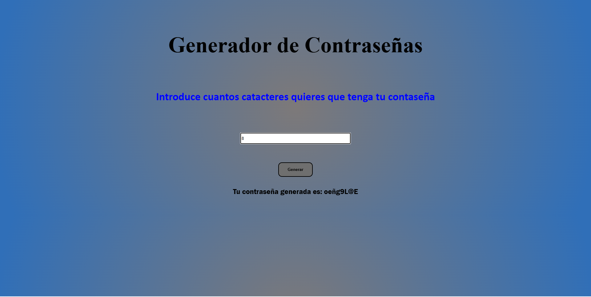

# Generador de Contraseñas

Este proyecto te ayudara a generar una contraseña de la cantidad de caracteres que quieras, de forma aleatoria


## Instalacion

Para instalar el proyecto se necesita clonar el repositorio

```bash
  git clone https://github.com/OscarCuso/generador-de-contrasenas.git
  cd generador-de-contrasenas
```

## Uso del proyecto

```bash
  Abrir index.html
```

En la caja de texto se ingresa el valor que quieras que tenga tu contraseña


Despues de ingresar el valor escogido le das clic en generar


Y saldra la contraseña generada, con los caracters seleccionados 


## Pagina del proyecto

-[Pagina Generador de contraseña](https://oscarcuso.github.io/generador-de-contrasenas/)

## Autores

-[@OscarCuso](https://github.com/OscarCuso)
